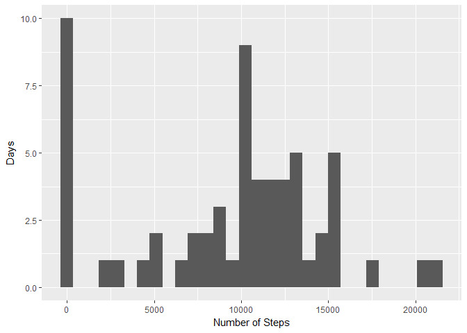
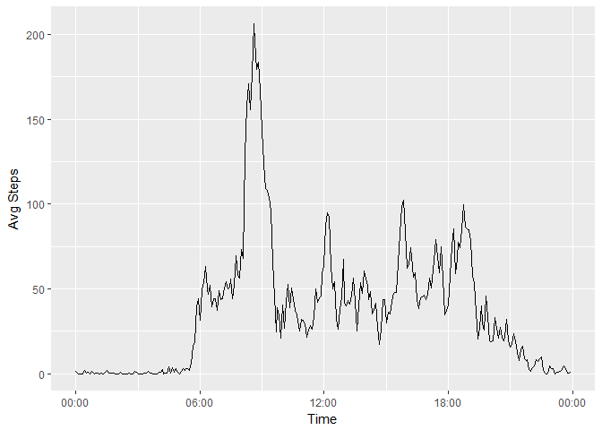
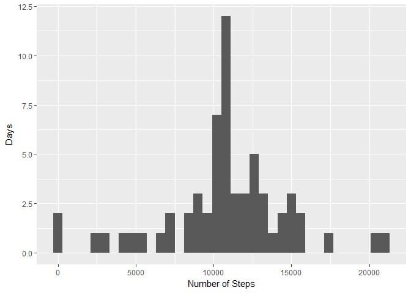
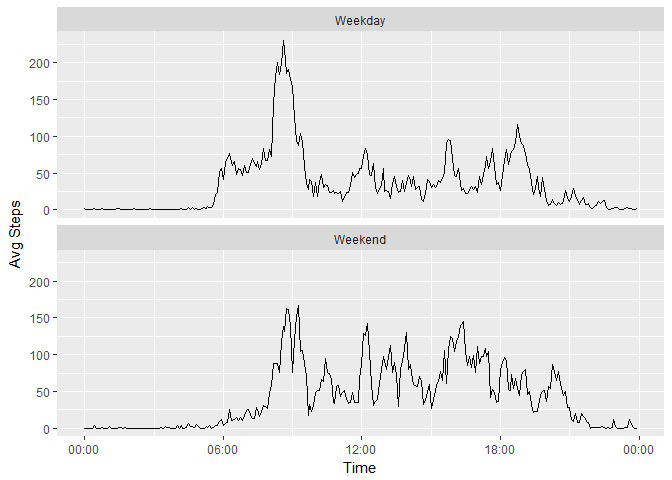

# Reproducible Research: Peer Assessment 1
### Ian Arbuckle

## Loading and preprocessing the data

The data are in a tidy format. The only change for ease of processing will be to interpret the **date** variable as a POSIXct data type.


```r
a <- read.csv("activity.csv")
a$date <- as.POSIXct(a$date)
```

## What is mean total number of steps taken per day?

The **dplyr** functions for grouping and summarizing will be useful here. First, set up a new tibble with the sum of steps per day, excluding **NAs** per the assignment instructions:


```r
library(dplyr)
totala <- a %>%
  group_by(date) %>%
  summarize(total = sum(steps, na.rm = TRUE))
```

This dataset can be displayed now as a histogram.


```r
library(ggplot2)
p <- ggplot(totala, aes(total))
p + geom_histogram() + labs(x = "Number of Steps", y = "Days")
```

<!-- -->

And a mean and median value can be determined:


```r
totala %>%
  summarize(Mean = mean(total), Median = median(total))
```

```
## # A tibble: 1 × 2
##      Mean Median
##     <dbl>  <int>
## 1 9354.23  10395
```

## What is the average daily activity pattern?

First, we need to group and average the number of steps across the 5-minute intervals.


```r
inta <- a %>%
  group_by(interval) %>%
  summarize(avg = mean(steps, na.rm = TRUE))
```

Then we can plot these data with the interval minutes on the x-axis. To represent the time series, first the **interval** variable should be interpreted as a 24 hr time of hours and minutes. 


```r
library(lubridate)
tstr <- mapply(function(x, y) paste0(rep(x, y), collapse = "")
               , 0
               , 4 - nchar(inta$interval))
inta$dttm <- paste0(tstr, inta$interval)
inta$dttm <- strptime(inta$dttm, format = "%H%M")
```

Then the average steps can be plotted. 


```r
p <- ggplot(inta, aes(dttm, avg))
p + geom_line() + labs(x = "Time", y = "Avg Steps") + scale_x_datetime(date_labels = "%H:%M")
```

<!-- -->

## Imputing missing values

There are a couple of quick ways to obtain the number of **NA** values in the dataset. My favorite is just using the **summary** function:


```r
summary(a)
```

```
##      steps             date                        interval     
##  Min.   :  0.00   Min.   :2012-10-01 00:00:00   Min.   :   0.0  
##  1st Qu.:  0.00   1st Qu.:2012-10-16 00:00:00   1st Qu.: 588.8  
##  Median :  0.00   Median :2012-10-31 00:00:00   Median :1177.5  
##  Mean   : 37.38   Mean   :2012-10-31 00:25:34   Mean   :1177.5  
##  3rd Qu.: 12.00   3rd Qu.:2012-11-15 00:00:00   3rd Qu.:1766.2  
##  Max.   :806.00   Max.   :2012-11-30 00:00:00   Max.   :2355.0  
##  NA's   :2304
```

My strategy for imputing the values for these **NAs** will be to use the mean of the particular 5 minute interval, as stored in the *inta* frame.


```r
b <- merge(a, inta, by.x = 3, by.y = 1)
b$steps <- with(b, ifelse(is.na(b$steps), b$avg, b$steps))
b$dttm <- as.POSIXct(b$dttm)
```

With imputed values now present in the **b** dataset, the histogram of steps by day may show differences from that containing **NAs**. 


```r
totalb <- b %>%
  group_by(date) %>%
  summarize(total = sum(steps))
p <- ggplot(totalb, aes(total))
p + geom_histogram(binwidth = 600) + labs(x = "Number of Steps", y = "Days")
```

<!-- -->

And the by-day mean and median values can be recomputed to show the impact of imputed values:


```r
totalb %>%
  summarize(Mean = mean(total), Median = median(total))
```

```
## # A tibble: 1 × 2
##       Mean   Median
##      <dbl>    <dbl>
## 1 10766.19 10766.19
```

Imputing values for **NAs** in this case creates a distribution that has a more normal shape, and causes the mean and median to converge.

## Are there differences in activity patterns between weekdays and weekends?

Adding in a factor variable to the dataset with imputed values to classify days of activity as either a weekday or a weekend.


```r
b$day_type <- as.factor(with(b, ifelse(weekdays(b$date) %in% c("Saturday", "Sunday"), "Weekend", "Weekday")))
```

With a factor available to distinguish, we can now plot a comparison between weekday and weekend activity.


```r
intb <- b %>%
  group_by(day_type, interval) %>%
  summarize(avg = mean(steps))

tstr <- mapply(function(x, y) paste0(rep(x, y), collapse = "")
               , 0
               , 4 - nchar(intb$interval))

intb$dttm <- paste0(tstr, intb$interval)
intb$dttm <- strptime(intb$dttm, format = "%H%M")
intb$dttm <- as.POSIXct(intb$dttm)
p <- ggplot(intb, aes(dttm, avg))
p <- p + geom_line() + labs(x = "Time", y = "Avg Steps") + scale_x_datetime(date_labels = "%H:%M")
p + facet_wrap(~day_type, nrow = 2)
```

<!-- -->

We can see that weekdays tend to have a higher early mode, but subsequent modes tend to fall below the corresponding intervals of the weekends.
